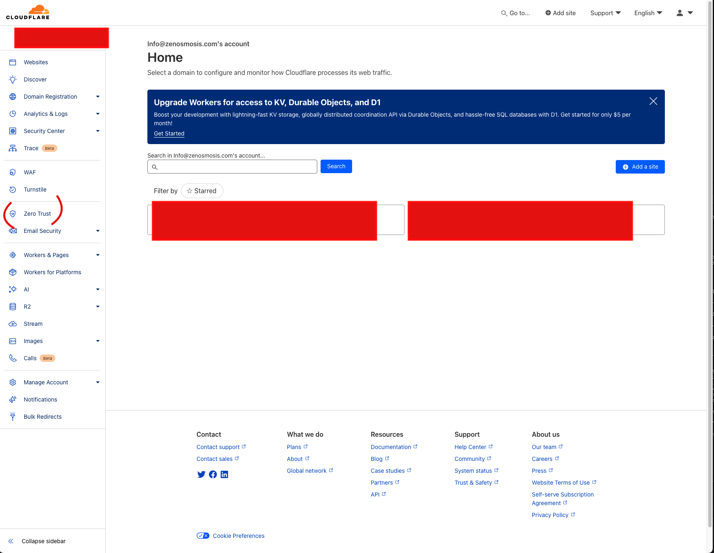
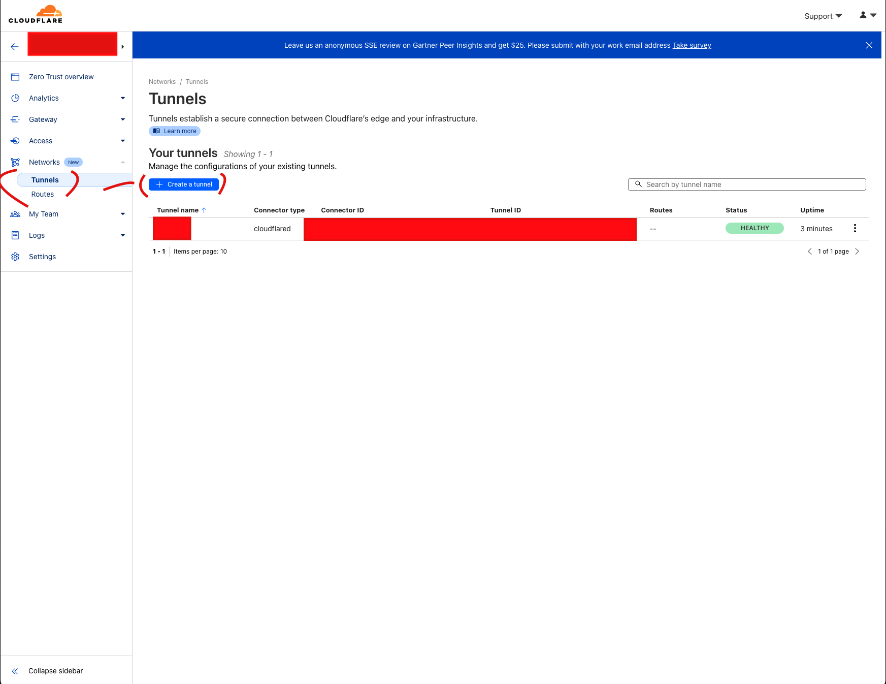
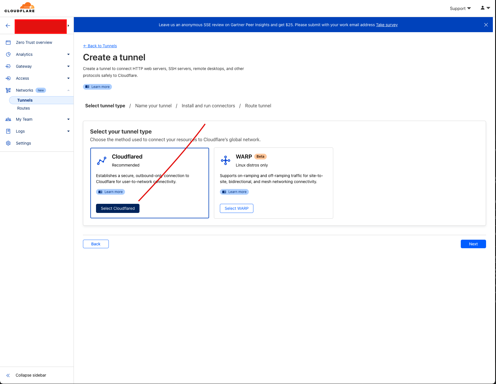
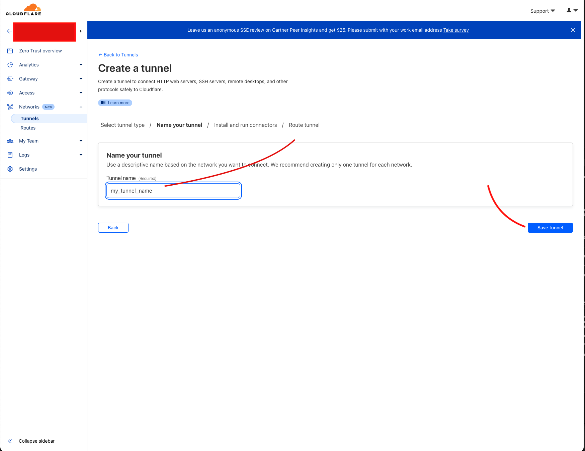
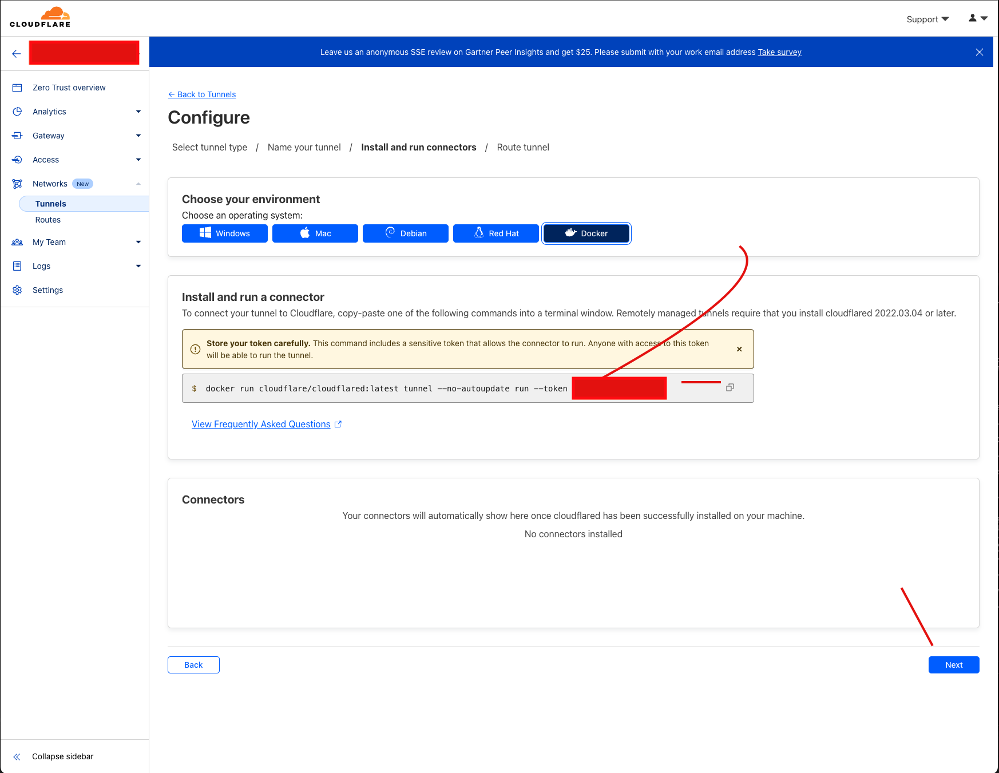
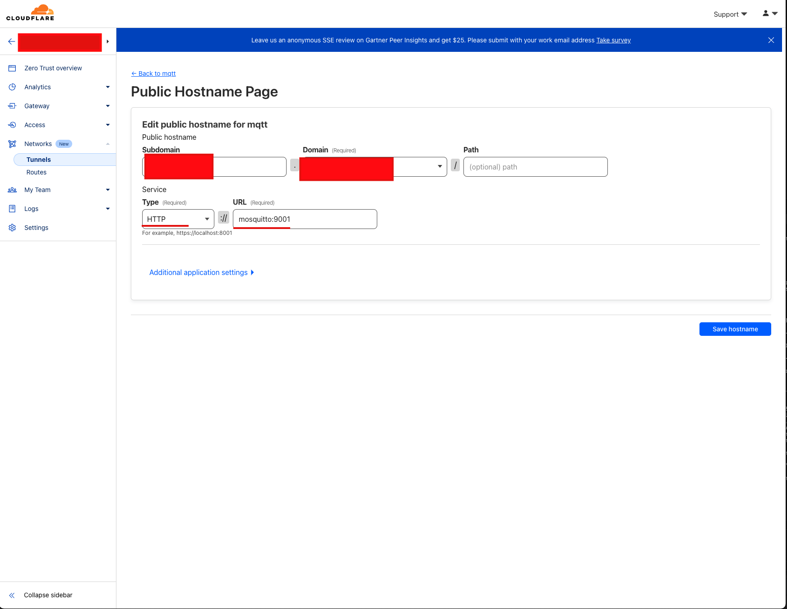

# Docker MQTT Mosquitto Cloudflare Tunnel

**Note:** This differs from the [main branch](https://github.com/jzombie/docker-mqtt-mosquitto-cloudflare-tunnel), with the following:

- Restricts wildcard searches across users (in a naive fashion where the first level of a topic is the username, with protections provided by an [ACL file](https://github.com/jzombie/docker-mqtt-mosquitto-cloudflare-tunnel/blob/protected-no-wildcard/mosquitto/aclfile))
- Encrypts retained messages using [gocryptfs](https://nuetzlich.net/gocryptfs/)
- Auto-saves retained messages after every message

---

This setup demonstrates how to configure and deploy an MQTT broker using Eclipse Mosquitto within a Docker container and securely expose it to the internet via a Cloudflare Tunnel. This setup is particularly useful for IoT applications, allowing secure and scalable message brokering over the MQTT protocol.

- https://en.wikipedia.org/wiki/MQTT
- https://mosquitto.org/
- https://www.cloudflare.com/
- https://www.cloudflare.com/products/tunnel/


## Step-by-Step Guide for Navigating Cloudflare

The following steps will guide you through the process of setting up an MQTT broker, configuring a Cloudflare Tunnel to expose the broker to the public internet, and managing access and routing through Cloudflare's network.

### Step 1: Log into Cloudflare Zero Trust
1. Go to the Cloudflare Dashboard and log in with your credentials.
2. In the left sidebar, click on **"Zero Trust"**.

   

### Step 2: Create a Tunnel
1. Under the **"Networks"** section in the sidebar, select **"Tunnels"**.
2. Click on **"Create a tunnel"**.

   

3. On the next screen, select **"Cloudflared"** as the tunnel type and click **"Next"**.

   

4. Enter a name for your tunnel, such as `my_tunnel_name`, and click **"Save tunnel"**.

   

5. Choose **"Docker"** as your operating system. Copy the provided Docker command which includes your unique token.

   

  Create an `.env` file in the base directory of this repo, and add `CLOUDFLARE_TUNNEL_TOKEN=your_token`.  See [.env.sample](.env.sample) for example.

  _Note: You do not need to run the provided Docker command on the screen. This repository replaces that step._

### Step 3: Set Up Public Hostname
1. After running the connector, navigate to the **"Tunnels"** section again and select the newly created tunnel.
2. Click on **"Next"** to proceed to the hostname configuration.

3. On the **"Public Hostname Page"**, fill in the required details:
   - **Public hostname**: Choose your desired subdomain and domain.
   - **Service**: Select the service type (HTTP).
   - **URL**: Set the URL to point to your Mosquitto service (e.g., `mosquitto:9001`). Docker will route the `mosquitto` hostname to the relevant `container_name` in the `docker-compose.yml`.

   

4. Click **"Save hostname"** to finalize the configuration.

### Step 4: Spin up the Containers

```bash
docker compose up
```
